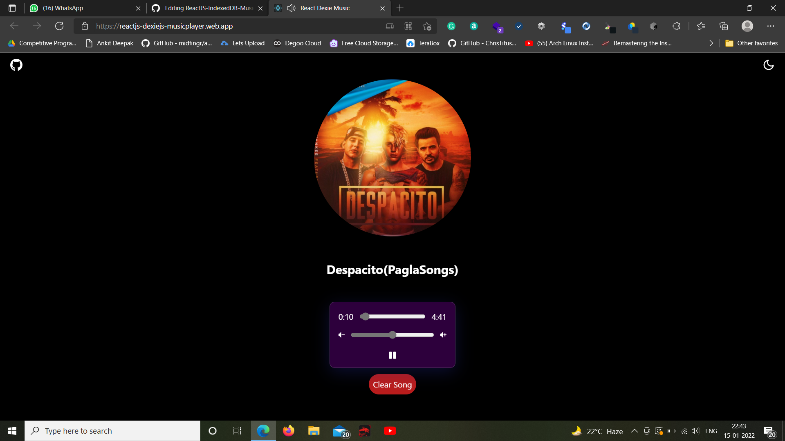
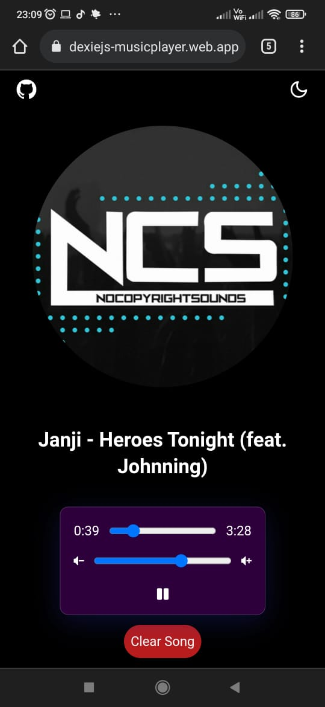
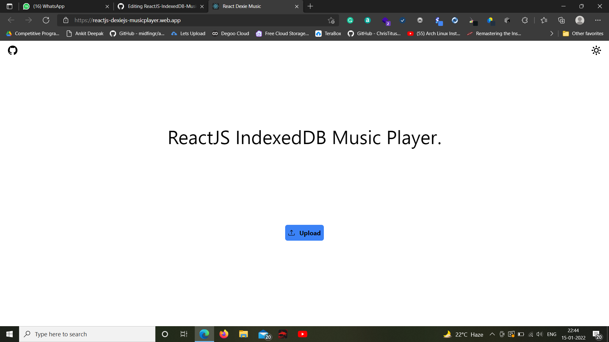

# The project is hosted on :- 
## <a href="https://reactjs-indexeddb-musicplayer-dexiejs.netlify.app/">https://reactjs-indexeddb-musicplayer-dexiejs.netlify.app//</a>

# This is a music player built using React JS. 
### Here music is uploaded through file input, which gets stored to browser memory IndexedDB through DexieJS and is then played through HTML Audio.

# Screenshots:-

